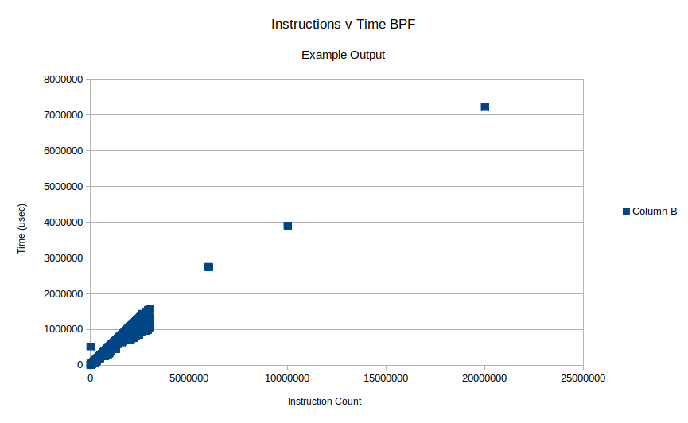

These instructions assume you have a standard `inner_unikernels` setup in your `$HOME`. While this benchmark can be ran from mainline, instructions are not provided.

## Setting the instruction limit

The BPF verifier currently has a limit of one million (1,000,000) instructions. To run some of the tests, you must change this limit.

This can be set by changing the `BPF_COMPLEXITY_LIMIT_INSNS` macro definition in the `/include/linux/bpf.h` file of the source tree.


## Generating test samples

```
# Build the samples

cd ~/inner_unikernels/
make insn_benchmark

# Samples will be located in .../verifier_time/libbpf-bootstrap/examples/c/insn_bench
```

You will have to move all of these binaries into the VM/device you are going to run the benchmark on.

## Running the benchmark

Copy `perform_bench.sh` into the VM. It should be in the same directory where all the `minimal*` samples are.

Run it. Results will be written to `results-[datetime].csv`. You can use your favorite software (e.g, LibreOffice Calc, Excel) to analyze it.

**OPTIONAL:** If you are not using q-script, copy the samples to `~/inner_unikernels/rootfs/guest`
## Changing the workload

Adjustments can be made on the increment size of the loop for each interval and how many intervals to perform.

Open the `Makefile`. The first arg is the number of intervals. The second is the increment size.

## Outliers

Outliers are hard-coded in the script. You must modify the `generate_tests.sh` to change them.

## Known Issues

### 

This benchmark uses a simple method of obtaining how much memory the verifier uses that isn't accurate due a race coniditon, however the measurement it gives is "good enough" for our use-case (seeing the relation). Additionally, the benchmark will report zero memory use if the workload is too light.

## Example Output

Using
```
intervals=300
increment=1000
```
### Instructions and Time



### Instructions and memory, no branches

Doesn't include the first 100 files generated from the script.


